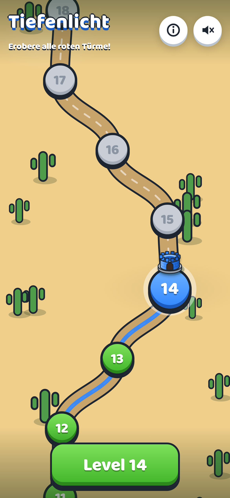
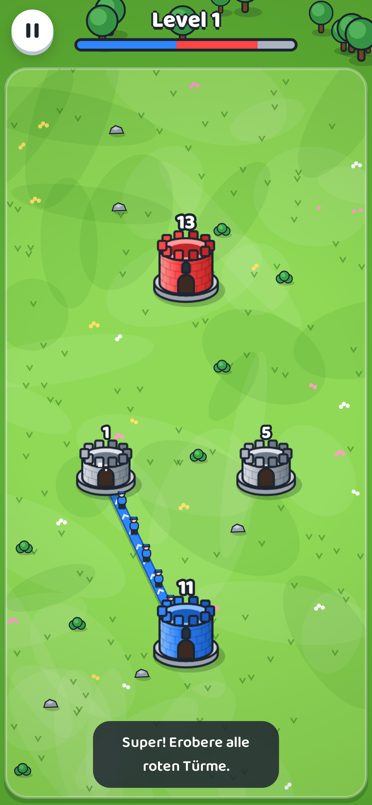
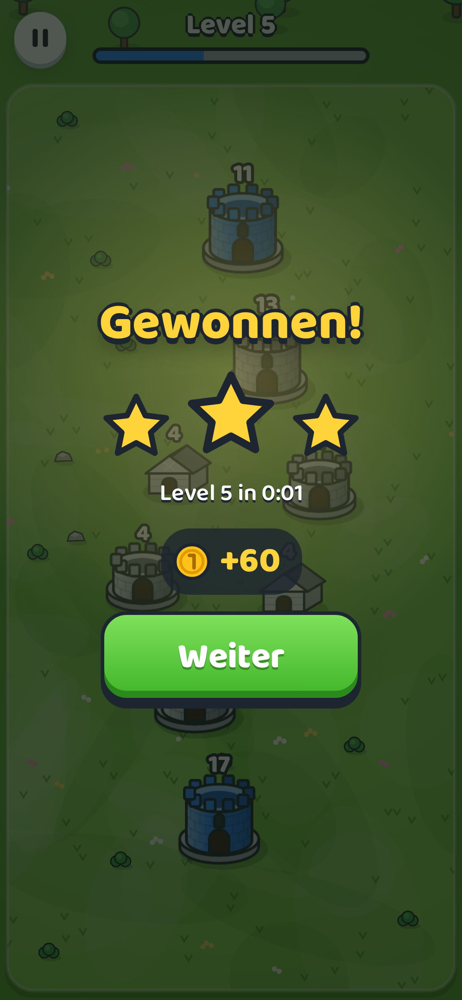
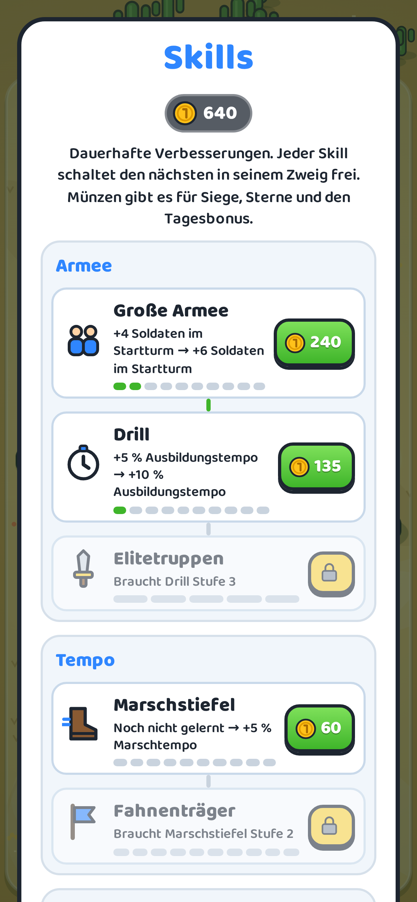

# Burgensturm

Das Spiel heißt im Spiel **Burgensturm**; das Repository behält den Namen „Tiefenlicht“, damit der Link gleich bleibt.

Türme erobern im Stil von Tower War: Ziehe Linien von deinen blauen Türmen, schicke Soldaten los und nimm alle roten Türme ein. Browser- und Handyspiel als PWA, spielbar unter **https://stefanschiederer.github.io/Tiefenlicht/**. Auf dem iPhone in Safari „Teilen → Zum Home-Bildschirm“ wählen.

| Kampagnen-Karte        | Spiel                    | Sieg                  | Shop                   |
| ---------------------- | ------------------------ | --------------------- | ---------------------- |
|  |  |  |  |

## Spielregeln

- Jeder Turm zeigt seine Soldaten. Eigene Türme bilden laufend neue Soldaten aus (bis MAX = 50), graue (neutrale) nicht.
- Ziehe von einem blauen Turm zu einem anderen Turm. Die Linie bleibt, und Soldaten marschieren ununterbrochen hinüber. Jeder geschickte Soldat wird vom Turm abgezogen, der Turm wächst dabei weiter. Ein MAX-Turm schickt schneller. Weiße Punkte zeigen freie Linien, graue benutzte.
- Soldaten, die einen fremden Turm erreichen, ziehen dort einen ab. Fällt die Zahl unter null, gehört der Turm dir. Soldaten, die einen eigenen Turm erreichen, verstärken ihn.
- Türme wachsen mit ihren Soldaten: ab 10 Stufe 2 (zwei Linien), ab 25 Stufe 3 (drei Linien). Schrumpft ein Turm, verliert er überzählige Linien.
- Treffen sich Soldaten zweier Farben auf derselben Strecke, kämpfen sie eins gegen eins.
- Wische quer über eine eigene Linie, um sie zu kappen. Soldaten vor dem Schnitt laufen nach Hause, die dahinter marschieren weiter.
- Andere Türme und Hindernisse (Felsen, Teiche, Wäldchen) versperren gerade Linien. Mauern haben Lebenspunkte: Soldaten schlagen sie ein und marschieren dann weiter.
- Raketenschwarm (Knopf unten, kostet Münzen): zerstört Soldaten in einem gegnerischen Turm.
- Besondere Türme: **Kaserne** (ab Level 4) bildet doppelt so schnell aus, **Festung** (ab Level 6) zählt jeden Angreifer nur halb, **Kanonenturm** (ab Level 8) schießt fremde Soldaten in seiner Reichweite ab, neutrale Kanonen schießen auf alle. **Reiterhof** (ab Level 12) schickt schnelle Reiter, **Burg** (ab Level 16) hält eine Linie mehr und ist robust, **Zauberturm** (ab Level 20) trifft den stärksten feindlichen Turm in Reichweite mit Blitzen.
- Updates kommen automatisch und werden auf der Kampagnen-Karte eingespielt. Der Spielstand liegt im Browser-Speicher des Geräts und bleibt bei Updates erhalten.
- Gewonnen ist das Level, wenn keine gegnerischen Türme mehr übrig sind.

## Fortschritt

Sterne für schnelle Siege, Münzen für jeden Sieg und den Tagesbonus, ein Skill-Baum mit fünf Zweigen. Acht verschiedene Welten. Alle zehn Level wartet ein Boss-Level mit doppelter Belohnung.

## Entwicklung

```bash
npm install
npm run dev        # Entwicklungsserver
npm run check      # Lint, Unit-Tests, Build
npm run e2e        # Playwright (Desktop und iPhone hochkant)
npm run calibrate  # Level mit dem Test-Bot prüfen und src/game/calibration.json neu schreiben
```

- `src/game` – Regeln und Simulation (deterministisch, ohne DOM), Level-Generator, Gegner-KI.
- `src/render` – Canvas-2D-Grafik: Türme, Soldaten, Linien, Wiese, Mauern (alles prozedural gezeichnet).
- `src/app` – Spielablauf, Eingabe, Bildschirme, Sound, Spielstand, PWA.

Push auf `main` baut und veröffentlicht automatisch auf GitHub Pages.
