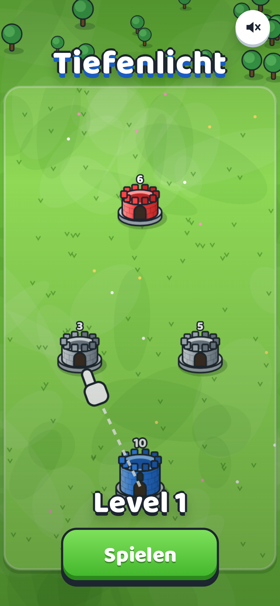
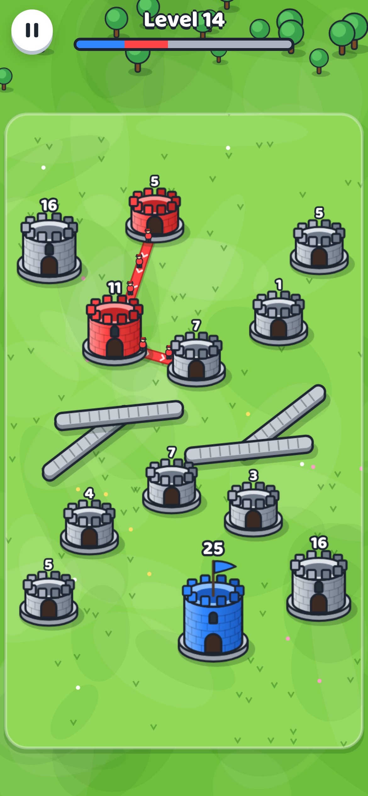

# Tiefenlicht

Türme erobern im Stil von Tower War: Ziehe Linien von deinen blauen Türmen, schicke Soldaten los und nimm alle roten Türme ein. Browser- und Handyspiel als PWA, spielbar unter **https://stefanschiederer.github.io/Tiefenlicht/**. Auf dem iPhone in Safari „Teilen → Zum Home-Bildschirm“ wählen.

| Start                    | Spiel                    | Späteres Level                |
| ------------------------ | ------------------------ | ----------------------------- |
|  |  |  |

## Spielregeln

- Jeder Turm zeigt seine Soldaten. Eigene Türme bilden laufend neue Soldaten aus, graue (neutrale) nicht.
- Ziehe von einem blauen Turm zu einem anderen Turm. Die Linie bleibt, und Soldaten marschieren ununterbrochen hinüber.
- Soldaten, die einen fremden Turm erreichen, ziehen dort einen ab. Fällt die Zahl unter null, gehört der Turm dir. Soldaten, die einen eigenen Turm erreichen, verstärken ihn.
- Türme wachsen mit ihren Soldaten: ab 10 Stufe 2 (zwei Linien), ab 25 Stufe 3 (drei Linien). Schrumpft ein Turm, verliert er überzählige Linien.
- Treffen sich Soldaten zweier Farben auf derselben Strecke, kämpfen sie eins gegen eins.
- Wische quer über eine eigene Linie, um sie zu kappen. Soldaten vor dem Schnitt laufen nach Hause, die dahinter marschieren weiter.
- Mauern und andere Türme versperren gerade Linien.
- Gewonnen ist das Level, wenn keine gegnerischen Türme mehr übrig sind.

## Entwicklung

```bash
npm install
npm run dev        # Entwicklungsserver
npm run check      # Lint, Unit-Tests, Build
npm run e2e        # Playwright (Desktop und iPhone hochkant)
```

- `src/game` – Regeln und Simulation (deterministisch, ohne DOM), Level-Generator, Gegner-KI.
- `src/render` – Canvas-2D-Grafik: Türme, Soldaten, Linien, Wiese, Mauern (alles prozedural gezeichnet).
- `src/app` – Spielablauf, Eingabe, Bildschirme, Sound, Spielstand, PWA.

Push auf `main` baut und veröffentlicht automatisch auf GitHub Pages.
